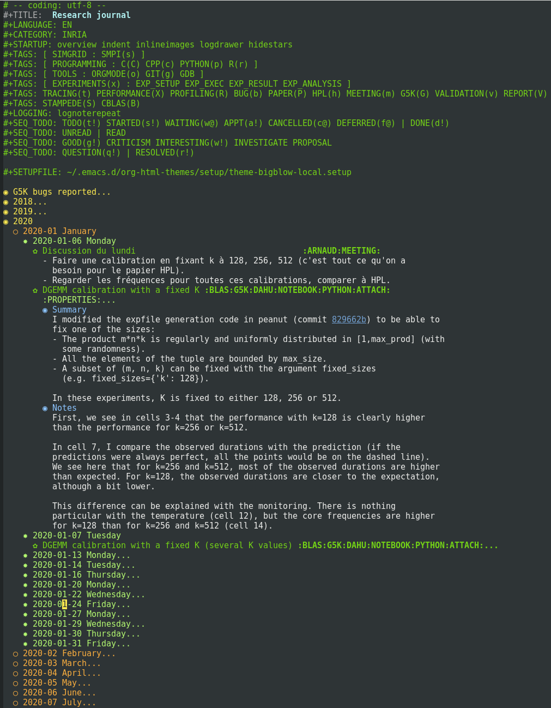

This is an extract of the laboratory notebook I used during my PhD. It uses Emacs with [Org
Mode](https://orgmode.org/fr/index.html). The file is sorted chronologically, with a year→month→day hierarchy. Each
entry on a given day may also have some sub-sections.

All the entries have at least one tag, often several, for classification purposes. Quite often, the entries have one or
several attached documents (marked with the tag `ATTACH`).  These attachments can be opened with `Ctrl-a o`.

Most of the attachments are either a paper (i.e. a PDF file with an associated bibtex entry) or a Jupyter notebook. For
these two kinds of attachments, I used the [org_attach](https://github.com/Ezibenroc/org_attach) script.

It contains only a few relevant entries, I decided to heavily prune the journal before making it public for several
reasons:

- Size reason. The real repository takes around 2.4 GB while this one only takes 14 MB.
- Pedagogical reason. The goal of this repository is to illustrate the methodology I used for my thesis. The full
  journal might be too large and the reader might get lost.
- Privacy reason. Some entries in my journal should not be made public, e.g. because they may contain a copyrighted
  paper, some un-published work, or even some rants on papers I disliked.

Here is a screenshot of the *full* journal:

